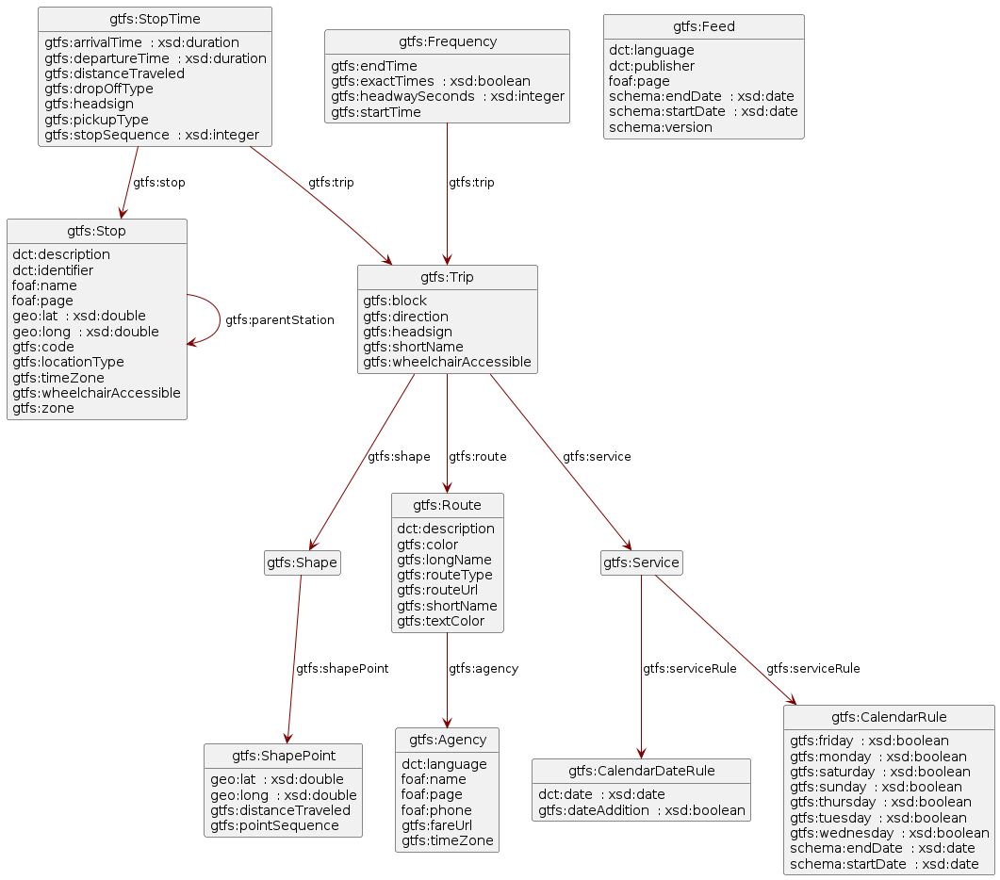
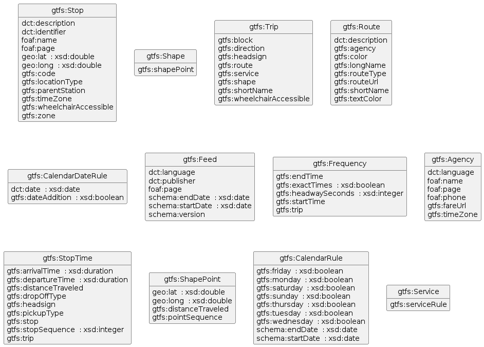

# Diagrams

Diagrams as illustration to section 2.1 related to paper [Reference conditions: relating mapping rules without joining](https://openreview.net/forum?id=7wQTpBuPRqN) submitted to KGCW 2023

## Diagram derived from the [original GTFS mapping file](./gtfs_mapping.rml.ttl) (with referencing object maps)

## Diagram derived from an [adapted GTFS mapping file](./loose_gtfs_mapping.rml.ttl) (with crafted URI templates)

## Steps taken to generate the diagrams

1. converted the mapping files to a SHACL files with [RML2SHACL](https://github.com/RMLio/RML2SHACL)
2. summarized the SHACL files (shape per class instead of shape per triples map) with additional script
3. converted summarized SHACL files to diagrams with [https://shacl-play.sparna.fr/play/draw](https://shacl-play.sparna.fr/play/draw)

